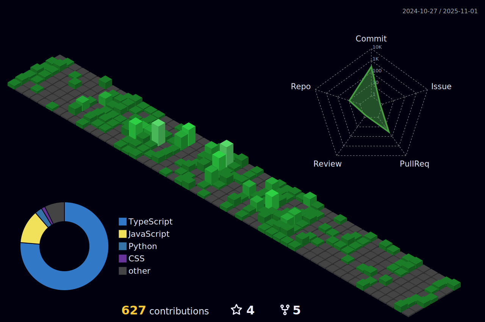

  

  <!-- Dynamic typing effect with improved text -->
  

  
📠Software Engineering Undergrad | 💻 Frontend Developer | 🨠UI/UX Designer

  
  <!-- Profile view counter and social links with improved styling -->

 

## 👨‍💻 About Me

I'm a passionate Software Engineer who transforms ideas into elegant digital experiences. With a keen eye for design and a love for clean, efficient code, I build applications that solve real-world problems while providing exceptional user experiences.

- 🔭 Currently : Advancing my **React JS skills** and learning new tech stacks
- 🌱 Learning: **Advanced State Management** and **Micro Frontend Architecture**
- 🚀 Goal for 2025: Contribute to **5+ major open-source projects**
- 💬 Let's talk about: **Frontend frameworks**, **UI/UX principles**, or **design systems**
- 📫 Reach me: [LinkedIn](https://linkedin.com/in/therandomuser03) or Twitter [@TheRandomUser03](https://twitter.com/TheRandomUser03)
- ⚡ Fun fact: My mornings run on both caffeine and a little superpower ☕

 

## 🛠️ Tech Arsenal

<table>
<tr>
<td valign="top" width="33%">

### 🎨 Frontend

<!--  -->

</td>
<td valign="top" width="33%">

### ⚙️ Backend & Data

<!--  -->

<!--  -->

</td>
<td valign="top" width="33%">

### 🔧 Tools & Design

<!--  -->
<!--  -->

<!--  -->

</td>
</tr>
</table>

 

## 📊 GitHub Analytics

    
  

 

## 🚀 Featured Projects

  
  

 

  
  

 

### 💼 Project Showcase

| Project | Description | Tech Stack | Role | Links |
|---------|-------------|------------|------|-------|
| **SignSage** | AI-powered sign language translation app with real-time detection and accessibility features | React, TensorFlow.js, Firebase | Lead Developer & Designer | [Demo](https://signsage.vercel.app) • [GitHub](https://github.com/therandomuser03/signsage) |
| **PinPoint** | Location-based service platform with interactive maps, POI discovery, and social features | React, Leaflet, Node.js, MongoDB | Frontend Developer | [Demo](https://pinpoint-app.vercel.app) • [GitHub](https://github.com/therandomuser03/PinPoint) |
| **CodersZone** | Developer community platform with forum functionality, code sharing, and mentorship matching | React, Express, MongoDB, Socket.io | Full-Stack Developer | [Demo](https://coderszone.vercel.app) • [GitHub](https://github.com/therandomuser03/CodersZone) |
| **Expanseo** | Personal finance tracking app with budget analytics, expense categorization, and financial insights | React, Chart.js, Firebase | UI/UX Designer & Developer | [Demo](https://expanseo.vercel.app) • [GitHub](https://github.com/therandomuser03/Personal-Finance-Manager) |

<!-- ## 📝 Latest Blog Posts
 BLOG-POST-LIST:START 
- [Building Accessible Web Applications: A Comprehensive Guide](https://hashnode.com/@therandomuser03)
- [React Performance Optimization Techniques](https://hashnode.com/@therandomuser03)
- [Designing Effective User Interfaces: Principles and Practices](https://hashnode.com/@therandomuser03)
- [Getting Started with TensorFlow.js for Web Applications](https://hashnode.com/@therandomuser03)
 BLOG-POST-LIST:END -->

 

## 🌐 Connect With Me

  
  
  
  
  
  

  
 

## 🎯 Future Roadmap
- 🤝 Contribute to **5+** major open-source projects<!-- - 📱 Build and publish a React Native app to app stores -->
- 🎨 Create and share a reusable UI component library
- 🔧 Master backend technologies and system architecture
- 🌐 Launch a personal technical blog

 

  

---

  
### ☕ Support My Work
  

    

